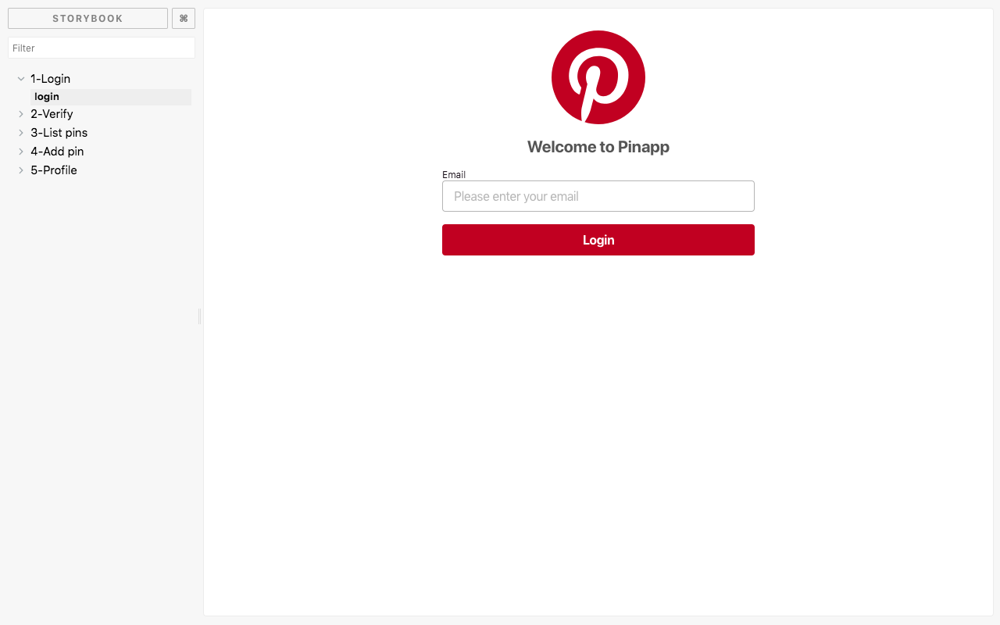

# PinApp components

React components used in the example application of the book [GraphQL Webapps](https://graphql.college/graphql-webapps).

## Installation

`yarn add pinapp-components` or `npm install pinapp-components --save`

## Playground

This library's components belong to a Pinterest clone called PinApp. See how each component looks like in the [playground](https://graphqlcollege.github.io/pinapp-components).



## Components API

GraphQL Webapps uses this components as the view layer of a client server application developed using NodeJS, Apollo Server and React Apollo.

This is the list of all components. Most of them correspond to URLs from PinApp:

* Container
  * Render `Container` as the first in your component hierarchy. It sets up styling and routing.
  * Props
    * Children
* Nav
  * Renders a list of actions in a footer. Actions are links to `/`, `/upload-pin` and `/profile`
* PinListPage
  * URL: `/`
  * Arguments:
    * `pins`: Array that contains a list of pins. Pins must be object with `title`, `image` and `link` properties. All three properties must be Strings.
* LoginPage
  * URL: `/login`
  * Props:
    * `authenticate`: Function that will run when the user clicks "login".
      * Arguments:
        * `email`: String
* VerifyPage
  * URL: `/verify?token=123456`
  * Props:
    * `verify`: Function that will run when the component mounts.
      * Arguments:
        * `token`: Token from the query string
* AddPinPage
  * URL: `/upload-pin`
  * Props:
    * `authenticated`: Boolean
    * `addPin`: Function that will run when the user clicks "Save". It receives a pin object as argument.
* ProfilePage
  * URL: `/profile`
  * Props:
    * `user`: Object with an `email` property
    * `authenticated`: Boolean
    * `logout`: Function that will run when the user clicks "Logout". It does not receive any arguments.

## Example usage

To see example usage, open `stories/index.stories.js`.

```js
import {
  Container,
  PinListPage,
  AddPinPage,
  LoginPage,
  VerifyPage,
  ProfilePage,
  Nav
} from "../";

class App extends React.Component {
  constructor(props) {
    super();
    this.state = {
      pins: props.pins || [],
      authenticated: props.authenticated || false
    };
  }
  render() {
    return (
      <Container noRouter={this.props.noRouter}>
        <PinListPage pins={this.state.pins} />
        <AddPinPage
          authenticated={this.state.authenticated}
          addPin={pin => {
            this.setState(({ pins }) => ({ pins: pins.concat([pin]) }));
          }}
        />
        <LoginPage authenticate={this.props.authenticate} />
        <VerifyPage
          verify={() =>
            this.props
              .verify()
              .then(token => this.setState({ authenticated: true }))
          }
        />
        <ProfilePage
          user={this.props.user}
          authenticated={this.state.authenticated}
          logout={this.props.logout}
        />
        <Nav authenticated={this.state.authenticated} />
      </Container>
    );
  }
}
```
